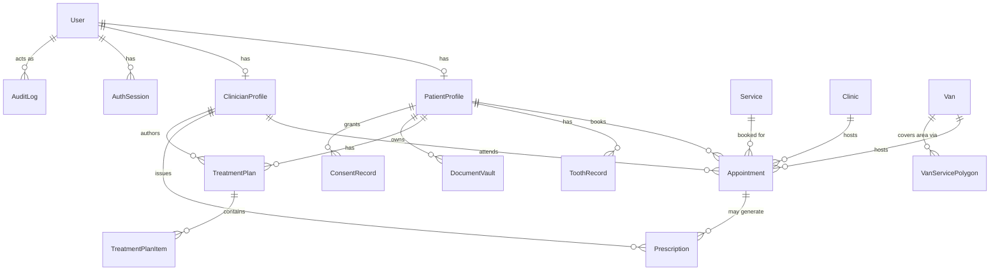

# Pav Dental — Architecture

> Verified directly against the codebase on 2026-09-20 (`git ls-tree`, `npm install`, `tsc --noEmit`) — not copied from the project's planning docs. Where docs and code disagreed, code wins. See §6 for what's actually broken and §7 for what's missing.

## 1. Actual State Summary

**Only one part of this product exists as real, working code: the backend API.** It's a genuine Express + TypeScript + Prisma service — 16 route modules, 27 database models, JWT auth, MFA, Stripe payments, audit logging — and `npm install` succeeds cleanly. But three auth flows fail to compile due to a method-vs-function mismatch (§6), CI is broken on both its jobs, and a populated `.env` is committed to git.

**The mobile app — the actual product a patient would use — does not exist in this repository.** The `pavdental/` directory at the repo root is a broken git submodule reference with no `.gitmodules` file, which almost always means someone `git add`ed a nested git repository without configuring it properly, so its contents (presumably the React Native/Expo app) were never pushed. It clones as an empty folder. Nothing in this repo currently lets a patient book an appointment, and there is no admin dashboard (`admin-dashbord`, referenced in GitHub's file browser, has no entry in the actual git tree at all).

The repo also contains 31 markdown files, most of them compliance/process planning (DSPT audit prep, penetration-test approval workflows, GDC verification, incident-response runbooks) describing intended process rather than implemented code. They create an impression of maturity the code doesn't back up yet.

## 2. Tech Stack

Only for what actually exists — the backend.

| Layer | Choice | Notes |
|---|---|---|
| Language | TypeScript (strict) | `tsconfig.json` in `backend/` |
| Runtime | Node.js ≥ 20 | per `backend/README.md` |
| Web framework | Express 4 | `backend/src/server.ts` |
| ORM | Prisma 6 (`@prisma/client`) | schema at `backend/prisma/schema.prisma` |
| Database | PostgreSQL 16 + PostGIS extension | `postgis/postgis:16-3.4` image in `docker-compose.yml`; PostGIS is used for van coverage-area polygons |
| Cache / locks | Redis 7 (`ioredis`) | slot-hold locking, session/rate-limit support |
| Auth | `jsonwebtoken` (JWT access + refresh), `argon2` password hashing | custom, not a third-party auth provider |
| Payments | Stripe (`stripe` SDK, PaymentIntents) | webhook handled with raw body before JSON parsing |
| Video | Daily.co (API key in env, no SDK import found in `package.json` — calls likely via REST) | `src/routes/video.ts` |
| File uploads | `multer` (in-memory/disk) → object storage | `src/lib/object-storage.ts` (S3/R2-style, CDN URL in env) |
| Validation | `zod` | one schema file per route group in `src/schemas/` |
| Security headers / rate limiting | `helmet`, `express-rate-limit` | global 200 req/15min, tighter 20 req/15min on auth routes |
| Testing | `jest` + `ts-jest` (integration), a custom `e2e-suite.ts` run via `tsx` | see §6 for gaps |
| Infra (local) | Docker Compose — Postgres + Redis only | no compose service for the API itself; run with `npm run dev` |

**Not present anywhere in the repo:** a frontend framework, a mobile app config (no `app.json`/`package.json` for Expo), a CI job that can actually complete, an ORM-independent migration runner beyond Prisma's own.

## 3. Repository Structure

```
pavdental/
├── backend/                    # REAL — the only implemented application code
│   ├── src/
│   │   ├── routes/             # 16 route modules (see §4)
│   │   ├── schemas/            # zod request/response schemas, 1:1 with routes
│   │   ├── middleware/         # auth, mfa, audit, validation, error handling
│   │   ├── lib/                # prisma/redis clients, jwt, encryption, otp, etc.
│   │   ├── config/env.ts       # typed env var loader
│   │   ├── types/mobile-api.ts # shared response/request types
│   │   ├── __tests__/          # jest integration tests (auth only)
│   │   └── e2e-suite.ts        # custom end-to-end script, run via `npm test`
│   ├── prisma/
│   │   ├── schema.prisma       # 27 models (§5)
│   │   ├── migrations/         # 7 migrations, applied in order
│   │   └── seed.ts             # seeds 2 clinics, 3 clinicians, 5 services, 1 van
│   ├── .env                    # ⚠️ REAL SECRETS COMMITTED — see §6
│   ├── .env.example
│   └── 13 markdown files       # compliance/process docs — see §7, treat as planning not fact
│
├── pavdental                   # ⚠️ BROKEN — git submodule link (mode 160000), no .gitmodules.
│                                #   Clones as an empty directory. This is presumably where the
│                                #   Expo/React Native mobile app should live. Its source is not
│                                #   recoverable from this repo alone.
│
├── expo-skills/                # NOT app code — Expo SDK reference docs for AI coding agents
├── mobile-app-ui-design/       # NOT app code — UI convention reference docs for AI coding agents
├── shared-types/               # api-types.ts, uk-localization.ts — types meant to be shared
│                                #   between backend and the (currently absent) mobile app
├── docker-compose.yml          # Postgres (PostGIS) + Redis only
├── .github/workflows/ci.yml    # ⚠️ both jobs fail as written — see §6
└── 18 markdown files            # compliance/process/planning docs at root — see §7
```

`admin-dashbord`, shown as a folder in GitHub's web file browser, **has no entry in `git ls-tree HEAD`** — it does not exist in the repository's actual history on `main`.

## 4. Backend Architecture

### Request pipeline (`src/server.ts`, in order)

1. `helmet()` — security headers
2. CORS — allow-list from `env.allowedOrigins`; requests with no `Origin` header (native mobile) are allowed through, browser callers must match the allow-list
3. Stripe webhook route registered **before** the JSON body parser, using `express.raw()`, because Stripe signs the raw body
4. `express.json({ limit: "2mb" })`
5. `x-request-id` header attached to every response
6. Global rate limiter — 200 req/15 min
7. `attachOptionalAuth` — decodes a JWT if present without requiring one (powers public-but-personalizable endpoints)
8. `standardResponse` — response-shape middleware
9. `/health` and `/health/audit-integrity` (admin-only)
10. Route mounting (below)
11. `notFoundHandler` → `errorHandler`

### Route map

| Method | Path | Auth | File |
|---|---|---|---|
| GET | `/api/services`, `/api/services/clinicians`, `/api/services/clinics` | Public | `routes/services.ts` |
| POST | `/api/auth/register`, `/login`, `/refresh` | Public (20 req/15min limiter) | `routes/auth.ts` |
| POST/GET/DELETE | `/api/auth/logout`, `/sessions`, `/sessions/:id` | Bearer | `routes/auth.ts` |
| POST | `/api/auth/verify-email/request`, `/confirm` | Public / Public | `routes/auth.ts` — ⚠️ confirm step broken, see §6 |
| POST | `/api/auth/password-reset/request`, `/confirm` | Public / Public | `routes/auth.ts` — ⚠️ confirm step broken, see §6 |
| POST | `/api/auth/mfa/request`, `/verify`, `/verify-session` | Bearer | `routes/auth.ts` — ⚠️ `/verify` broken, see §6 |
| GET/POST/PATCH | `/api/booking/slots`, `/hold-slot`, `/appointments`, `/appointments/:id/confirm`, `/appointments/:id/cancel` | Bearer | `routes/booking.ts` |
| PATCH | `/api/booking/appointments/:id/cancel-with-refund` | Bearer | `routes/cancellations.ts` |
| GET/PUT/POST | `/api/patients/:id/profile`, `/odontogram`, `/plans`, `/documents` | Bearer | `routes/patients.ts` |
| POST | `/api/payments/create-intent` | Bearer | `routes/payments.ts` |
| POST | `/api/payments/webhook` | Stripe signature | `routes/payments.ts` (mounted directly in `server.ts`, ahead of JSON parsing) |
| POST/GET | `/api/video/rooms`, `/upload-triage-photo`, `/submit-triage`, `/clinician-queue`, `/admit-patient` | Bearer | `routes/video.ts` |
| POST/GET | `/api/prescriptions/`, `/patient/:userId` | Bearer | `routes/prescriptions.ts` |
| POST/GET | `/api/notifications/register-token`, `/preferences`, `/send`, `/schedule`, `/history`, `/send-receipt` | Bearer | `routes/notifications.ts` |
| POST/GET | `/api/van/coverage-check`, `/fleet`, `/stops`, `/stops/:id/check-in`, `/stops/:id/complete` | Public (coverage-check) / Bearer (rest) | `routes/van.ts` |
| POST/GET | `/api/waitlist/join`, `/` | Bearer | `routes/waitlist.ts` |
| POST/GET | `/api/consents/grant`, `/withdraw`, `/history`, `/current`, `/data-access-request`, `/data-deletion-request` | Bearer | `routes/consents.ts` |
| POST/GET | `/api/triage/check`, `/emergency-info` | Bearer / Public | `routes/triage.ts` |
| GET | `/api/dspt/dspt-report` | Bearer | `routes/dspt-audit.ts` |
| GET/PATCH | `/api/admin/overview`, `/users`, `/appointments`, `/appointments/:id/status`, `/vans`, `/audit-logs` | Bearer + `admin` role | `routes/admin.ts` |
| POST/GET | `/api/audit/log`, `/logs` (admin), `/integrity`, `/retention`, `/failures` | Bearer | `routes/audit.ts` |

Every route group except `/api/services` and the Stripe webhook is wrapped in `auditMiddleware`, which logs the request to `AuditLog`.

### `src/lib/` modules

| File | Purpose |
|---|---|
| `prisma.ts`, `redis.ts` | Singleton clients |
| `jwt.ts` | Access/refresh token signing & verification |
| `otp-service.ts` | `EmailVerificationService`, `PasswordResetService`, `TwoFactorService` classes + a standalone `hashToken()` function — see §6, these don't currently connect correctly |
| `encryption.ts` | Field-level encryption helpers (for clinical record fields) |
| `audit-integrity.ts` | Hash-chains each `AuditLog` entry against the previous one to detect tampering |
| `audit-monitoring.ts` | Background integrity-check loop, started from `server.ts` on boot |
| `audit-security.ts` | Supporting audit helpers |
| `idempotency.ts` | Idempotency-key storage to prevent duplicate writes (e.g. double-charging) |
| `job-queue.ts` | Background job queue (Redis-backed) |
| `object-storage.ts` | S3/R2-style file storage; note: `Error('Download not implemented in development mode')` — downloads are stubbed locally |
| `structured-logging.ts` | JSON structured log output |
| `triage-escalation.ts` | Logic for escalating video-triage submissions |
| `api-client.ts` | Outbound HTTP client wrapper |

### `src/middleware/`

`auth.ts` (`requireAuth`, `requireRole`, `attachOptionalAuth`), `mfa.ts` (step-up MFA enforcement), `patient-access.ts` (row-level ownership checks so patients can't read each other's records), `validate.ts` (zod body/query/param validation), `audit.ts` (writes the audit trail), `error-handler.ts` (redacts sensitive fields from error responses/logs).

## 5. Data Model

27 Prisma models in `backend/prisma/schema.prisma`, backed by 7 applied migrations. Core relationships:



Other standalone/support models: `EmailVerificationToken`, `PasswordResetToken`, `MfaCode`, `MfaVerification` (all token/user pairs), `PushToken`, `NotificationPreference`, `ScheduledNotification`, `NotificationHistory` (notification subsystem, all keyed to `User`).

Notable design choices visible in the schema:
- Money stored as integer pence (`pricePence`, `depositPence`, etc.) — avoids float rounding
- `Appointment.channel` (`clinic` / `van` / `video`) is a single polymorphic booking type rather than three separate tables
- `Appointment.status` includes a `draft_hold` state — appointments are created as a temporary hold before payment/confirmation, matching the Redis slot-lock flow in `booking.ts`
- `VanServicePolygon.polygonGeoJson` is a `Json` column, not a native PostGIS geometry column — despite Postgres running the PostGIS extension, coverage-area matching appears to happen in application code against stored GeoJSON rather than via PostGIS spatial queries (worth confirming against `routes/van.ts`'s coverage-check logic if PostGIS performance matters later)
- `AuditLog.integrityHash` implements hash-chaining (see `lib/audit-integrity.ts`) — each entry can be verified against the previous one

## 6. Known Broken / Blocking Issues

Confirmed by actually running `npm install` and `npx tsc --noEmit` in `backend/`, not assumed.

| # | Issue | Where | Impact | What "fixed" looks like |
|---|---|---|---|---|
| 1 | **Mobile app source missing.** `pavdental/` is a dangling git submodule reference (`160000 commit a6fff32e...`, no `.gitmodules`) | repo root | No frontend exists to run at all | Either recover the original source (check the referenced commit hash against any remote it once pointed to) or scaffold a fresh Expo app and wire it to the backend's routes |
| 2 | **Three auth flows fail to compile.** `emailVerificationService.hashToken()`, `passwordResetService.hashToken()`, `twoFactorService.hashToken()` are called as instance methods in `routes/auth.ts` (lines 276, 361, 453), but `hashToken` is only ever exported as a standalone function in `lib/otp-service.ts` — it's never attached to those classes | `src/routes/auth.ts:276,361,453` | Email verification confirm, password reset confirm, and MFA verify all break | Either call the standalone `hashToken(token)` function directly instead of `service.hashToken(token)`, or add a `hashToken` method to each class in `otp-service.ts` |
| 3 | **CI is broken on both jobs.** `backend` job runs `npm run lint`, but no `lint` script exists in `backend/package.json`. `mobile` job runs `npm ci` inside `pavdental/`, which is empty | `.github/workflows/ci.yml` | Every push/PR fails CI | Add a lint script (or remove the step) for backend; fix or remove the mobile job until issue #1 is resolved |
| 4 | **Real secrets committed to git.** `backend/.env` is tracked in the repository despite `.gitignore` listing `/backend/.env` — it predates that rule or was force-added | `backend/.env` | JWT secrets, Stripe key, Daily.co key are exposed in git history | Rotate every secret in the file, then remove it from git history (not just delete it going forward) |
| 5 | Prisma client types unresolved at typecheck time (`Module "@prisma/client" has no exported member 'PatientProfile'`, etc.) | `src/middleware/patient-access.ts` | Blocks compilation until `prisma generate` has been run | Run `npx prisma generate` before building; verify this resolves it (untested here — `binaries.prisma.sh` was network-blocked in the sandbox used to verify this document) |
| 6 | Several implicit-`any` parameters despite `strict` mode intent | `routes/admin.ts`, `routes/booking.ts`, `routes/consents.ts`, `routes/notifications.ts`, `routes/patients.ts`, `routes/van.ts` | Type safety gaps, not runtime-breaking | Add explicit parameter types |
| 7 | Integration test file has ~17 `'data' is of type 'unknown'` errors | `src/__tests__/auth-integration.test.ts` | Tests likely don't typecheck cleanly under `tsc --noEmit`; unclear if they currently pass at runtime | Type the fetch/response helpers used in the test file |
| 8 | Setup doc has a hardcoded personal path | `backend/README.md` (`cd /Users/hhello/Documents/project 101/pavdentalapp`) | Confusing/wrong for anyone else following setup | Replace with a relative or generic path |
| 9 | `object-storage.ts` throws `Error('Download not implemented in development mode')` | `src/lib/object-storage.ts:75` | Document/file downloads won't work locally | Implement a local dev fallback or document the limitation |

## 7. What's Missing for "Functional and Working"

Gap list between today and a patient actually booking and attending an appointment, roughly in the order it needs to happen:

1. **Fix issue #2 above** — three auth flows are currently unreachable; nothing downstream matters until users can verify email, reset passwords, and complete MFA.
2. **Rotate and purge the committed secrets** (issue #4) before this touches anything beyond local dev — Stripe and Daily.co keys are live-shaped values.
3. **Stand up the mobile app.** This is the largest gap. Whether recovered or rebuilt, it needs to at minimum: auth screens, service/clinic browsing (`GET /api/services*`), slot booking + Stripe PaymentSheet (`STRIPE-PAYMENTSHEET-INTEGRATION.md` documents the intended approach), and an appointments view. `shared-types/api-types.ts` already exists specifically to be imported by this app — confirm it's still an accurate mirror of the backend's actual request/response shapes before building against it.
4. **Fix CI** (issue #3) so that regressions are caught automatically going forward instead of silently, as happened here.
5. **Verify the Prisma client actually generates and the full test suite runs** in an environment with unrestricted network access — this document's verification was done in a sandbox that blocked `binaries.prisma.sh`, so issue #5 needs a clean confirmation.
6. **Decide what to do with the 31 compliance/planning markdown files.** They're not wrong to have researched, but nothing in them is implemented yet (DSPT audit process, GDC verification workflow, penetration-test approvals, recording policy). Treat them as a backlog, not as documentation of current behavior, until each is actually wired to code.
7. **No deployment target is defined anywhere in the repo** — `docker-compose.yml` only runs Postgres and Redis for local dev; there's no Dockerfile for the API itself and no deployment config (`INFRASTRUCTURE-AS-CODE.md` describes an intended approach but nothing in the repo implements it).

## 8. Setup Instructions (corrected)

```bash
# 1. Start Postgres + Redis
docker compose up -d
docker compose ps   # both should report healthy

# 2. Install backend dependencies
cd backend
npm install
npx prisma generate

# 3. Apply migrations
npx prisma migrate deploy   # applies the 7 existing migrations

# 4. Seed baseline data
npm run prisma:seed
# seeds: 2 London clinics, 3 clinicians (real-format GDC numbers),
# 5 services, 1 van with a Central London coverage polygon

# 5. Copy env and fill in real values — do NOT reuse the committed .env (see §6, issue #4)
cp .env.example .env
# then fill in DATABASE_URL, REDIS_URL, JWT_*_SECRET, AUDIT_IP_HMAC_SECRET, STRIPE_*, etc.

# 6. Run the API
npm run dev
curl http://localhost:3000/health
# expect: { "status": "ok", "checks": { "database": "ok", "redis": "ok" } }
```

Note: auth flows for email verification, password reset, and MFA will return errors until issue #2 (§6) is fixed — `hashToken` is called as a method that doesn't exist on those service classes.

There is currently no equivalent set of steps for the mobile app, because there is no mobile app source in this repository (§6, issue #1).
